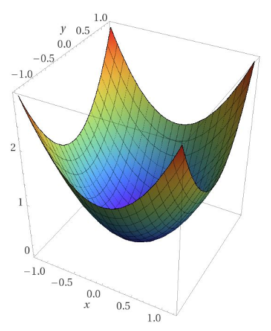
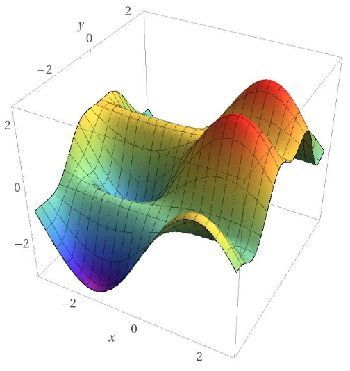
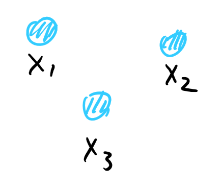
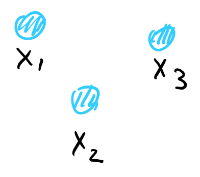
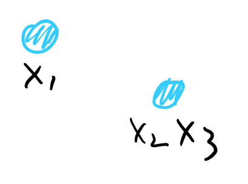
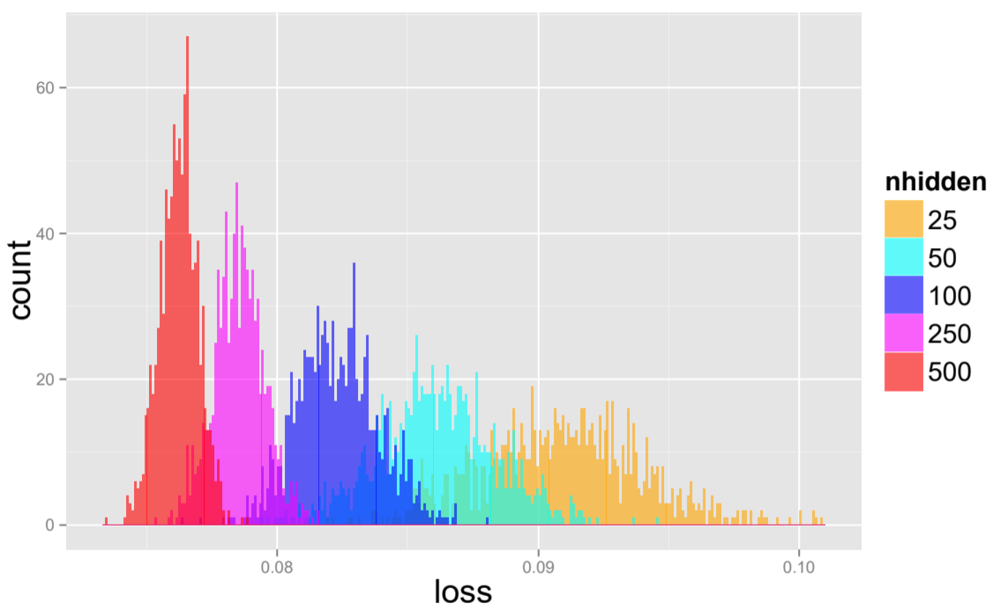

# Optimization

Landscape Symmetry, Saddle Points and Beyond

---

## Non-convex Optimization

{} Proabilistic Models, {}{} Deep Neural Nets {}

- {} **Theory**: [NP-hard](https://en.wikipedia.org/wiki/NP-hardness). Better avoid or use convex relaxation. {}
- {} **Practice**: Easy! just run SGD. {}


- In practice, these algorithms converge to good solutions.

 
---

## Gradient Descent

$$
x_{t+1} = x_t - \eta\nabla f(x_t)
$$

{} Converges to stationary point ($\nabla f(x_t)=0$) [[Nesterov '98]](http://rd.springer.com/book/10.1007%2F978-1-4419-8853-9) {}
{} or "local minimum" [[Ge etal. '15]][GHJY15] {}

---

### GD cannot escape from a local optimal solution

---

## Landscape

{}
Convex Functions

- Simple: 0 gradient → Global Minimum
- Can be optimized efficiently
{}

{}
Non-Convex Functions

- Complicated: local minima, saddle points
- GD can only find a local minimum
{}

---

## What special properties make a non-convex function easy?

{} Why are the objectives always non-convex? {}

---

### Symmetry → Non-Convexity

{} Problem asks for multiple components, but the components have no ordering.

---


- The neurons in a layer of neural network can be permuted and still compute the same function.


---

{}
<figure>
  
  <figcaption>Solution (a)</figcaption>
</figure>
{}

{}
<figure>
  
  <figcaption>Solution (b)</figcaption>
</figure>
{}

{}
<figure>
  
  <figcaption>Convex Combination (a+b)/2</figcaption>
</figure>
{}


- if the objective is convex, then the third solution is also convex
- 10 min mark


---

### Optimization algorithms need to break the symmetry and converge to one of the (equivalent) local minima.

---

## Saddle Points

[$$z = x^2 - y^2 + y^4 + 0.1\cdot y$$](https://academo.org/demos/3d-surface-plotter/?expression=x*x-y*y%2By%5E4%2B0.1*y&xRange=-1%2C%2B1&yRange=-1%2C%2B1&resolution=50)


- Global minimum
- Local minimum
- Saddle points


---

## Symmetry → Non-Convexity

[$$f(x) = -\\\|x\\\|^2 + \\\|x\\\|_4^4$$](https://academo.org/demos/3d-surface-plotter/?expression=x%5E4%2By%5E4-x%5E2-y%5E2&xRange=-1.5%2C%2B1.5&yRange=-1.5%2C%2B1.5&resolution=50)


- This construction is used in independent component analysis
- Four local/global minima (symmetric)
- Connection two adjacent local minima
- Can we add constraints to break the symmetry?
- Rotate and restrict in the first quadrant.
- This will add new local minima.


---

## Locally Optimizable Functions

- {}Local min are symmetric versions of global min{}
- {}No high order saddle points{}


- high order saddle points have zero grads and p.s.d. hessian
- SGD garanteed to find the global minima
- first condition seems to be very strong


---

* SVD/PCA
* Generalized Linear Model [KKKS'11] [HLS'14]
* Synchronization [BVS'16]
* Dictionary Learning [SQW'17]

---

* Matrix Completion [[GLM16]] [[GJZ17]]
* Matrix Sensing [BNS'16] [PKCS'16]
* MAX-CUT [MMMO'17]
* Tensor Decomposition [GHJY'15] [GM'16]
* 2-Layer Neural Net [[GLM17]]


- Matrix completion as a simple example
- Landscape of neural networks


---

## Matrix Completion

- {}Low rank matrix $M${}
- {}Observations: entries of $M${}
- {}Goal: recover remaining entries{}


- typical application: recommendation system [RennieSrebro05]
- assume matrix is a product of two $n\times r$ matrix
- Hope to recover using $\tilde O(nr)$ observations.


---

### Non-Convex Objective

* {} Idea: Try to find the low rank factors directly $$M=U\cdot V^T$$ {}
* {} Variables $X$, $Y$. Hope $X = U, Y = V, M = XY^T$ {}
* {} Uniform observations $(i, j)\in\Omega$ {}
* {} Minimize "loss" on observed entries $$\min f(X, Y) = \sum_{(i,j)\in\Omega}(M_{i, j} - (XY^T)_{i,j})^2$$ {}

---

### Symmetry and Solutions

$$M=UV^T\qquad \min(f(X, Y):=\\\|M-XY^T\\\|^2_\Omega)$$

- {} Hope: $X=U, Y=V$ {}
- {} Not true: many equivalent solutions: $$UV^T=URR^TV^T$$ {}
- {} Saddle points: e.g. $X=Y=0$ {}


- The objective behaves similar to a norm

---

> Theorem: when the number of observations is at least $\tilde{\Omega}(nr^6)$, all local minima of $f(X, Y)^*$ are global minima: satisfy $XY^T=M$.

[[GLM16]]: symmetric case; [[GJZ17]]: asymmetric case

---

> Corollary: Simple SGD can solve matrix completion from an arbitrary starting point.

Prior work:
  * convex relaxation
  * non-convex optimization with carefully chosen starting point


- convex relaxation: has tight $r$ $\Omega(nr poly(\log(d))$ d is #observations
- non-convex: $nr^2$
- 27 min mark


---

$X$ is a local minimum of $f(X)$ → $\nabla f(X)=0, \nabla^2f(X)\succcurlyeq 0$

{}
$$\nabla f(X)\ne 0$$

Follow gradient reduces $f(X)$.
{}

{}
$$\lambda(\nabla^2f(X))<0$$

Min eigendirection of Hessian reduces $f(X)$.
{}

---

### Direction of Improvment Exists

If $X$ is not global minimum

Exists $\Delta$, $\langle\nabla f(X), \Delta\rangle\ne 0$ or $\nabla^2f(X)[\Delta]<0$

---

### Matrix Factorization

- Every entry is observed, want to write $M=UV^T$
- {} Consider symmetric case: $M=UU^T$ $$g(X):=\\\|M-XX^T\\\|_F^2$${}
- {} Goal: prove local minima satisfy $XX^T=M$. {}

---

$\nabla g(X)=0${} → $MX=XX^TX$ {} {} → If $\text{span}(X)=\text{span}(M)$, $M=XX^T$ {}

{}$\nabla^2 g(X)\succcurlyeq0${}{} → $\text{span}(X)=\text{span}(M)$ {}

{}Approach in [[GLM16]]. Need more cases to work for Matrix Completion.{}


- $X$ is a full-rank matrix == span(X) = span(M) (span of column vectors)
- for the case X is not full rank, for example X=0, gradient = 0


---

- {} Intuitively, want $X$ to go to the optimal solution $U$.{}
- {} Recall: many equivalent optimal solutions! {}
- {} Idea: find the "closest" among all optimal solutions $$\Delta = X-UR, \qquad R=\arg\min||X-UR||_F$${}
- {} Nice property: $||\Delta\Delta^T||_F^2\le2||M-XX^T||_F^2${}


- Alternative approach finding direction of improvement
- If $\Delta$ is not zero, $X$ is not global optimal


---

### Main Lemma [[GJZ17]]

> Lemma: If $\\\|\Delta\Delta^T\\\|_\Omega^2<3\\\|M-XX^T\\\|_\Omega^2$, then either $\langle\nabla f(X), \Delta\rangle\ne 0$ or $\nabla^2 f(X)[\Delta]<0$. ($\Delta$ is a direction of improvement.)

- {} $||\Delta\Delta^T||_F^2\le2||M-XX^T||_F^2${}
- {} Immediate proof for matrix factorization {}
- {} For completion, proof works as long as $||A||_\Omega\approx ||A||_F$ for $\Delta\Delta^T$ and $M-XX^T$ {}


- $\Delta\Delta^T$ and $M-XX^T$ are both low rank.


---

### [Restricted isometry property](https://en.wikipedia.org/wiki/Restricted_isometry_property)

characterizes matrices which are nearly orthonormal, at least when operating on sparse vectors.
 
Applies to asymmetric cases, matrix sensing and robust PCA.

---

### Locally optimizable problems

- Low rank matrix
  - SVD/PCA, Matrix Completion, Synchronization, Matrix Sensing, GLM, MAX-CUT
- Low rank tensor
  - Dictionary Learning, Tensor Decomposition, 2-Layer Neural Net

---

## Optimization landscape for neural network

$$
g_W(x) = \sigma(W_p\sigma(W_{p-1}\sigma(\cdots \sigma(W_1x)\cdots)))
$$

$$
f(W) = \mathbb E[\\\|y - g_W(x)\\\|^2]
$$


- Fully connected with ReLU
- 40 min mark


---

### Teacher/Student Setting

- Goal: Prove sth about optimization
- Assume there is already a good network ($W^*$) and enough samples
- Good solution: student mimic teacher


- Make sure that the hypothesis class can recover the solution
- Focus on optimization


---

### Linear Networks

$$
g_W(x) = W_pW_{p-1}\cdots W_1x
$$

[[Kawaguchi 16](https://arxiv.org/abs/1605.07110)], [[YSJ18](https://arxiv.org/abs/1707.02444)]

- {} All local minima of linear neural network (with squared loss) are global* {}
- {} With 2 layers, no higher order saddle points. {}
- {} With 3 or more layers, has higher order saddles. {}


- All methods rely on different assumptions. Not comparable and not clear whether the assumptions are necessary


---

- For a critical point, if product of all layers has rank $r$, then it is a local and global minima (if r = min(m, n)) it can also be a normal saddle point (if r < min(m, n)).
- Open problem: does local search actually find a global minimum?


- min(m, n) the maximum rank we can get
- Algorithm can be trapped in higher order saddles


---

### Two-Layer Neural Network

$$
g(x) = a^T\sigma(Bx)
$$

- {}Wlog: rows of $B$ ($b_i$) are unit norm.{}
- {}Data: $x\sim N(0, I)$, $y$ from a teacher.{}
- {}Some more technical assumptions on a*, B* {}


- most importantly, $B^*$ is full-rank


---

### Bad local minima

Claim: The objective function $f(a, B)$ has local minima that are not equivalent to the ground truth.

- Observed in [[GLM17]]
- formmaly verified in [[Safran&Shamir17]]


- Over-parametrization appears to drastically reduce such local minima


---

### Landscape Design

- Idea: Design a new objective with no bad local min.
- Implicit in many previous techniques
  - Regularization
  - Methods-of-moments instead of MLE

---

### Provable New Objective

> Theorem[[GLM17]]: Can construct an objective for two-layer neural network such that all local minima are global*

- {}Objective inspired by tensor decomposition{}
- {}Relies on Gaussian distribution{}
- {}Extended to symmetric input distribution* by [[GKLW18]]{}


- There are some assumptions for global* to be hold


---

Theorem[[GKLW18]]: For a two-layer neural network with more outputs than hidden units, if the input distribution is symmetric, there is a polynormial time algorithm that learns the neural network

---

Theorem[[GWZ19]]: For a 2/3-layer neural network with quadratic/polynormal activations, if the inputs are in general position, and

#parameters = O(1) #training samples

GD can memorize training data.

---

### Spin Glass Model

> Claim[[CHMBL15]]: all the local minima of a neural network have approximate equal function value

---

### Kac-Rice Formula

$$
\int_x\mathbb E[|\det(\nabla^2 f)|\cdot \mathbf 1(\nabla^2 f\preceq0)\mathbf 1(x\in Z)|\nabla f(x)=0]p_{\nabla f(x)}
$$

- {}Proof idea: Count number of local min directly{}
- {}Evaluate the formula using random matrix theory{}
- {}Formal for spin-glass model (random polynormials), informal connection with NNs.{}
- {}Formal results for overcomplete tensor and tensor PCA{}


- Kac-Rice formula can be used to compute #local minima in any region
- In some cases, Hess and grad will be nice random matrices


---

### Dynamics/Trajectory

- {}Main idea: instead of analyzing the global landscape, analyze the path from a random initialization.{}
- {}Observation: path can be very short{}

---

- Empirical Risk/Training Error
  - [Du, Zhai, Poczos, Singh] Two-layer
  - [Allen-Zhu, Li, Song] [Du, Lee, Li, Wang, Zhai] [Zou, Cao, Zhu, Gu] Multi-layer/ResNet
  - [Allen-Zhu, Li, Song] Recurrent Neural Network
- Population Risk/Test Error
  - [Li Linag] Special multiclass classification
  - [Allen-Zhu, Li, Liang] 2 or 3 layer neural network. "Kernel-like" setting, special activation


- Suppose your model is over-parametrized, it can overfit to your data
- Considering generalization is harder.
- Kernel-like means the neural net is approximable using low-degree polynomials
- and requires special activation


---

## [Beyond Optimization](http://www.offconvex.org/2019/06/03/trajectories/)

Accelerated methods are faster but leads to slightly worse generalization.


- GD has an innate bias towards finding solutions with good generalization
  - Methods to speed up gradient descent (e.g., acceleration or adaptive regularization) can sometimes lead to worse generalization.
- We need to develop a new vocabulary (and mathematics) to reason about trajectories. This goes beyond the usual “landscape view” of stationary points, gradient norms, Hessian norms, smoothness etc


---

### Finding a global minimum is not always good enough (trajectory/implicit bias)

---

## [Neural Tangent Kernels](http://www.offconvex.org/2019/10/03/NTK/)

Optimization is easy (linear) in highly overparametrized regime

---

### How many parameters do we need?

[CHMBL15]: https://arxiv.org/abs/1412.0233 "The Loss Surfaces of Multilayer Networks"
[GHJY15]: https://arxiv.org/abs/1503.02101 "Escaping From Saddle Points --- Online Stochastic Gradient for Tensor Decomposition"
[GLM16]: https://arxiv.org/abs/1605.07272 "Matrix Completion has No Spurious Local Minimum"
[GJZ17]: https://arxiv.org/abs/1704.00708 "No Spurious Local Minima in Nonconvex Low Rank Problems: A Unified Geometric Analysis"
[GLM17]: https://arxiv.org/abs/1711.00501 "Learning One-hidden-layer Neural Networks with Landscape Design"
[Safran&Shamir17]: https://arxiv.org/abs/1712.08968 "Spurious Local Minima are Common in Two-Layer ReLU Neural Networks"
[GKLW18]: https://arxiv.org/abs/1810.06793 "Learning Two-layer Neural Networks with Symmetric Inputs"
[GWZ19]: https://arxiv.org/abs/1909.11837 "Mildly Overparametrized Neural Nets can Memorize Training Data Efficiently"